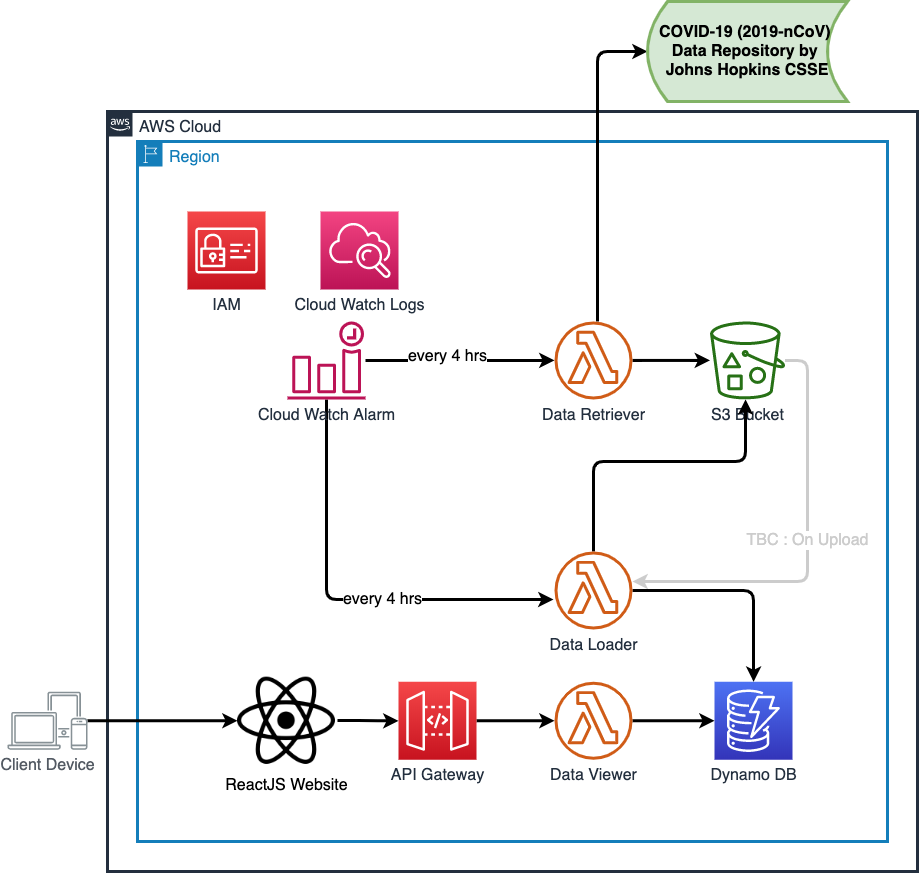

# COVID-19 Global Dashboard 

## Retrieve Covid-19 near realtime data using a AWS serverless model



### This simple serverless architecture comprises of 4 core components

#### Data Retriever

This function's sole responsibility is to read csv data from Johns Hopkins CSSE data source and store in a AWS S3 bucket. An AWS Cloud Watch event rule has been setup to trigger every 4 hours and invoke this lambda function.

#### Data Loader
This lambda gets triggered as soon a new data file gets loaded in AWS S3 bucket. Once triggered it will download csv data files, parse it and writes into a AWS DynamoDB No-SQL table. (Note- current version of this application, this function gets triggered via AWS Cloud Watch event. I am on it!)

#### Data Viewer
This Lambda which is exposed via AWS API Gateway over HTTP scans AWS DynamoDB table based on partition key (country) and supply data to website to process further in sub milliseconds time.

##### /covid19/countries/latest - TBC

Get all country code & latest covid19 status corresponding to that country

##### /covid19/countries/`{countryCd}`/latest
Get latest covid19 status for a country
```console
$curl -i -X GET -H "x-api-key: <api-key-here>" -H "Accept: application/json" https://azurns8496.execute-api.ap-south-1.amazonaws.com/test/covid19/countries/India/latest

HTTP/2 200
date: Mon, 30 Mar 2020 18:51:42 GMT
content-type: application/json
content-length: 150
x-amzn-requestid: d3835078-c5ed-426e-a4e8-2f5546c3faf0
x-amz-apigw-id: KN7ltEu1BcwFmTA=
access-control-allow-methods: GET,OPTIONS
x-amzn-trace-id: Root=1-5e823fbe-bb6e7eec66873a61d5daed6a

{
    "last_updated": "03/30/2020, 15:43:25",
    "total_deaths": 27,
    "total_recovered": 95,
    "country": "INDIA",
    "total_confirmed": 1024
}
```

##### /covid19/countries/`{countryCd}`/`{date}` - TBC

Get latest covid19 status for a country on a given date

#### Website
This is a [react-bootstrap](https://react-bootstrap.github.io/) based UI component which makes API calls to search COVID-19 stats based on country & visualise data graphically using [plotly-react](https://plotly.com/javascript/react/).

#### Other Components
Other than above mentioned AWS services there are many other key services which has been utilised here as well.

AWS IAM — Identity, Authentication & Authorisation (each AWS components talks to another via IAM role only)

AWS Cloud Watch — Logging (every lambda has it's own Cloud Watch log groups)

AWS X-Ray — End to end observability (every lambda components has got x-ray SDK for python configured)

AWS SAM — Infrastructure as Code (IaC) (All backed components are created based on AWS SAM & few are raw CFTs; complete stack takes less than 10 min to setup!)

#### Challenges
There is one key technical challenge that I faced while consuming API exposed via AWS API Gateway from browser as it was having issues with CORS. After bit of googling I found the root cause & fix [here](https://stackoverflow.com/questions/54320336/aws-api-gateway-working-through-curl-but-not-working-through-javascript)

Another significant dev challenge was to deploy heavy lambda with many py-libs (upto ~7 MB) frequently under a slow WiFi network was killing me. I had gracefully fixed that by using Lambda Layers technic and I could deploy whole stack & test 10 times faster!

### Reference
https://react.semantic-ui.com/modules/dropdown/#types-search-selection

https://www.valentinog.com/blog/await-react/

https://dzone.com/articles/consuming-rest-api-with-reactjs

https://medium.com/@stephinmon.antony/aws-lambda-with-python-example-inserting-data-into-dynamodb-table-from-s3-7c4ea10a3efb

https://docs.aws.amazon.com/serverless-application-model/latest/developerguide/sam-property-function-schedule.html#sam-function-schedule-enabled

https://forums.aws.amazon.com/thread.jspa?threadID=242093

https://stackoverflow.com/questions/54320336/aws-api-gateway-working-through-curl-but-not-working-through-javascript

https://developer.mozilla.org/en-US/docs/Web/HTTP/CORS

https://enable-cors.org/server_awsapigateway.html

#### Setup Instruction
#### Deploy Backend Componenets
##### Deploy S3 Bucket
```console
cd backend-app/s3-bucket/
./deploy-bucket.sh
```
##### Deploy DynamoDB Table
```console
cd backend-app/dynamo-db/
./deploy-table.sh
```
##### Deploy Data Retriever
```console
cd backend-app/data-retriever/covid19-data-retriever-function
./deploy.sh
```
##### Deploy Data Loader
```console
cd backend-app/data-loader/covid19-data-loader-function
./deploy.sh
```
##### Deploy Data Viewer
```console
cd backend-app/data-viewer/covid19-data-viewer-function
./deploy.sh
```
#### Deploy Front End Componenets
### Test Instruction
#### Acceptance Test
TBC
#### Load Test
[load-test-instruction](data-viewer/README.md)
#### Contributing
 There are couple of issues & enhancement has been identified under [issues](https://github.com/subratamazumder/covid19/issues), feel free to raise PR :+1: or raise new issues to work upon.

### NOTE
Data to this API is supplied by [public data](https://github.com/CSSEGISandData/COVID-19) managed by [Johns Hopkins CSSE](https://systems.jhu.edu/research/public-health/ncov/)

This has been published on Linkedin as an [article](https://www.linkedin.com/pulse/how-can-you-build-your-own-global-covid19-dashboard-way-mazumder/)
