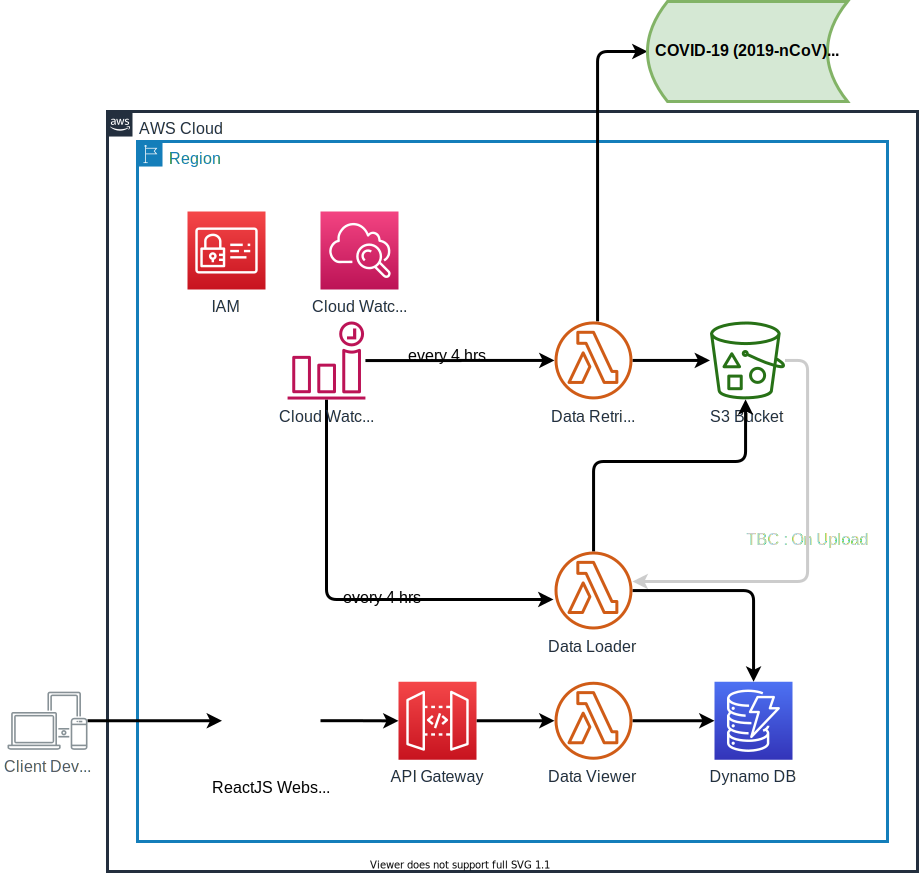

# COVID-19 API 

## Retrieve Covid-19 near realtime data using a AWS serverless model

### This simple serverless architecture comprises of 4 core components

#### 1. Data Retriever

Every 6 hours via Cloud Watch Alarm this Lambda will be triggred. Once triggred it will read data from `Johns Hopkins CSSE` data source which is managed & updated by `Johns Hopkins CSSE` for public use.

#### 2. Data Loader
This lambda gets triggered as soon a new data file gets loaded on S3. Once triggred it will read CSV data file and load incremental data by date to DynamoDB

#### 3. Data Viewer
This lambda reads data from DynamoDB table and supply data to s3 static website via API Gateway.

##### 3.1 /covid19/countries/latest

Get all country code & latest covid19 status corresponding to that country

##### 3.2 /covid19/countries/`{countryCd}`/latest
Get latest covid19 status for a country

##### 3.3 /covid19/countries/`{countryCd}`/{date}

Get latest covid19 status for a country on a given date

#### 4. Static S3 Website
 This react based component just to visualise data.

